###  I am Madhu
- Security Automation Ninja at [Appsecco](http://appsecco.com)
- I work on Security, DevOps and Cloud platforms
- I have been speaker & trainer at Defcon, All Day DevOps, DevSecCon
- Reported security bugs to Google, Microsoft, Yahoo
- My twitter is [@madhuakula](https://twitter.com/@madhuakula)


### About my company - Appsecco

Work with companies to test existing software they have for security issues and give them the information they need to fix any problems we find

Ensure that companies can recover from security incidents they suffer and work with them to stop them from reoccurring

Guide companies to design, specify, develop and purchase software that is secure

Note: We are an application security company. Providing security solutions, so that you can focus on your business.


### What will you learn today?
1. Monitoring your infrastructure by aggregating and analysing logs
2. How to centralise logging using the Elastic stack in near real-time
3. Creating dashboards for attack patterns monitoring
4. Working with dashboards for reporting and how to reuse them
5. Using Serverless(AWS Lambda) for automated defence


### This workshop does not cover
1. Performance tuning and optimisation for clusters
2. Multi cluster configurations
3. Custom plug-ins and scripts for Logstash

Note: I am not an expert in all the three topics mentioned above.


### Quick Overview 
*What I call trailer before the movie!* :)


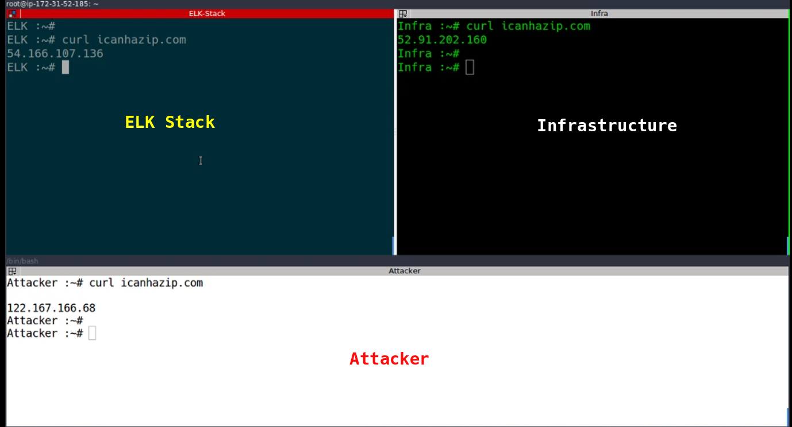

Note: In one screen I will show you Elastic stack, infrastructure and attacker


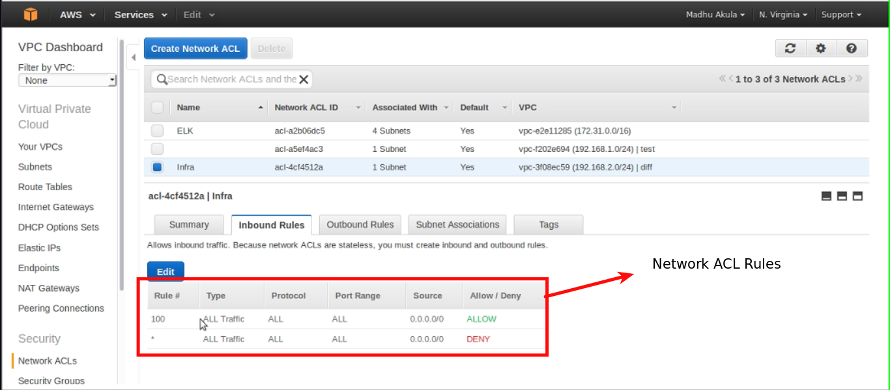

Note: SSH service is allowed from any source IP address. 


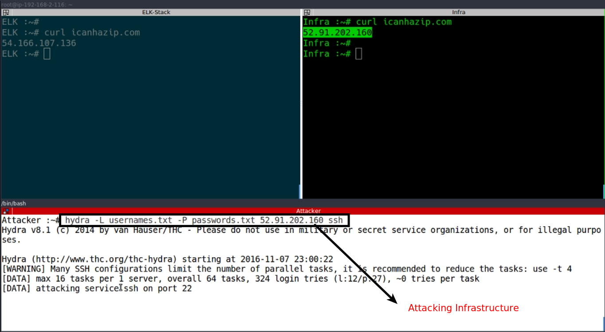

Note: 
1. Hydra is an open source brute forcing tool
2. Attacker will use Hydra to brute force our SSH service


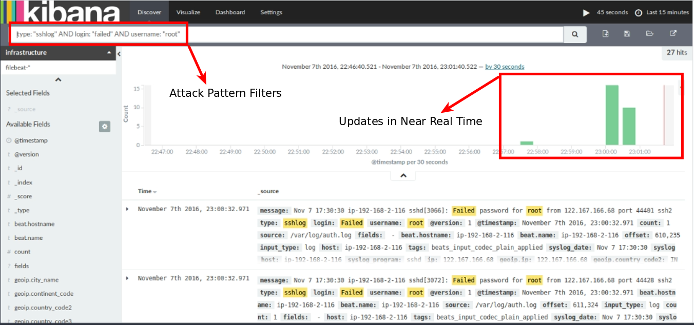

Note: Kibana is a visual dashboard to show the log data
Near real-time


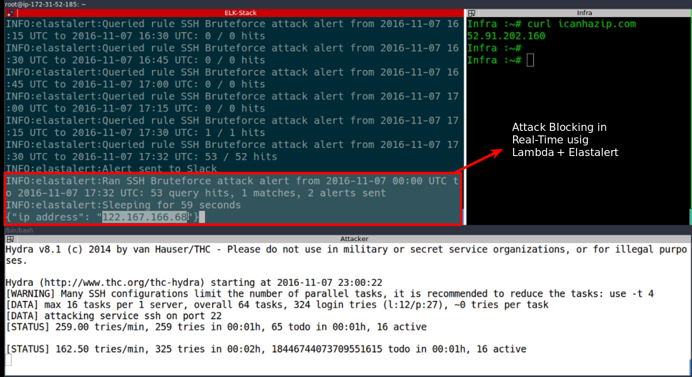

Note: 
1. Elastalert is an open source alerting tool for Elasticsearch
2. Blocking and alerting attacks using Elastalert


Note: Slack is a chat ops tool (Similar to IRC)
Slack message for alerts from Elastalert


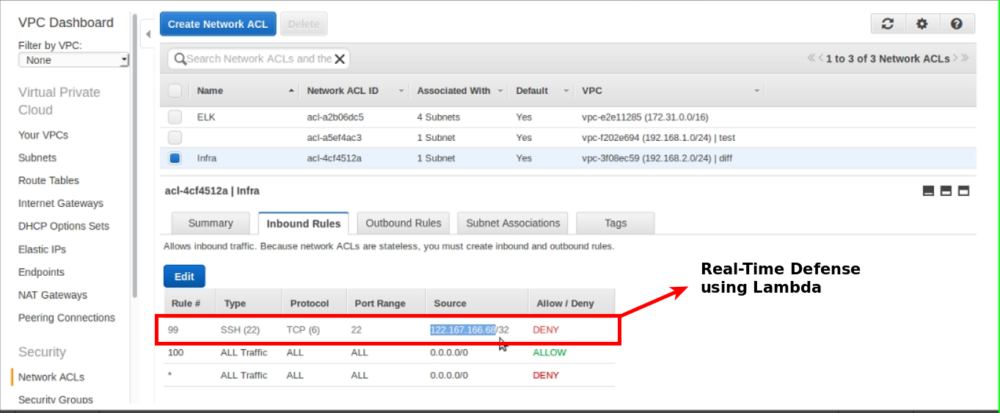

Note: Automatically a new inbound rule created
1. AWS Lambda is a compute service, which is Serverless
2. AWS labs, released a free and open source Serverless framework called Chalice
3. With my basic Python Flask skills, I was able to use Chalice to edit the network ACL
4. Have you heard of Python Flask? (Flask is a micro web framework written in Python)


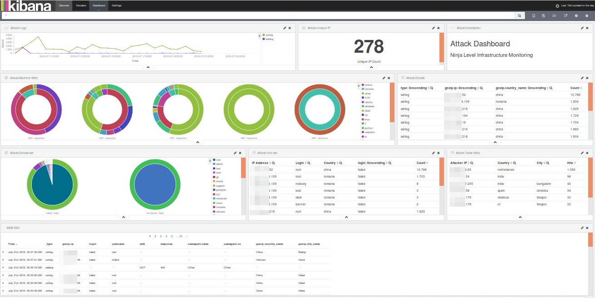

Note: 
1. Centralised place for security event monitoring dashboard


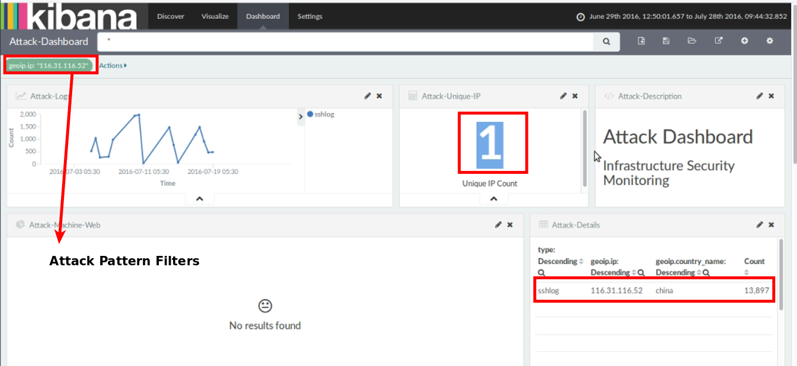

Note: Applying filters to the data in Kibana dashboard


### Modern Logging Solution 

- Elastic stack is made up of
  + Elasticsearch
  + Logstash
  + Kibana
  + Beats


## ELK overview
>
<small>Ref: https://www.elastic.co/products</small>

Note: 
1. Collect is equal to Beats
2. Enrich is equal to Logstash
3. Search is equal to Elasticsearch
4. Visualize is equal to Kibana


### Prerequisites
1. Familiarity with Linux command line
2. VirtualBox installed or administrator privileges to install it
3. Minimum 6 GB free disk space
4. Minimum 4 GB RAM
5. Enthusiasm to learn cool stuff :)


## Instructions
1. Please follow the commands and the overall flow as given in the slides
2. Please direct all questions/queries to instructors or volunteers


### Workshop architecture

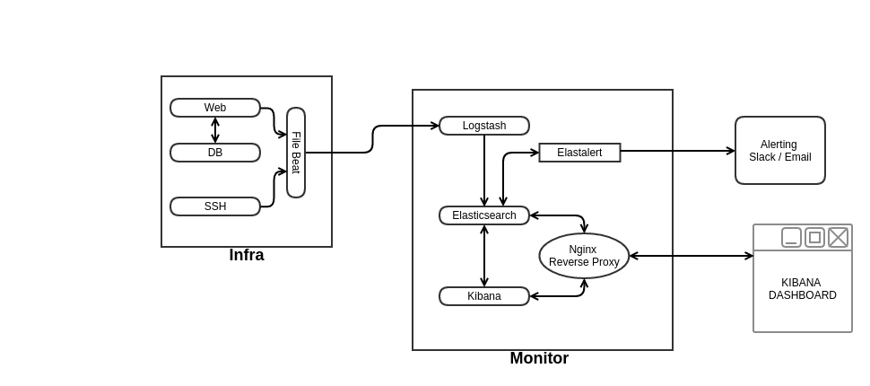


### Import the virtual machine appliance

Please import the virtual machine appliance from

`devsecon-asia-2017/Virtual-Machines/aismd.ova`


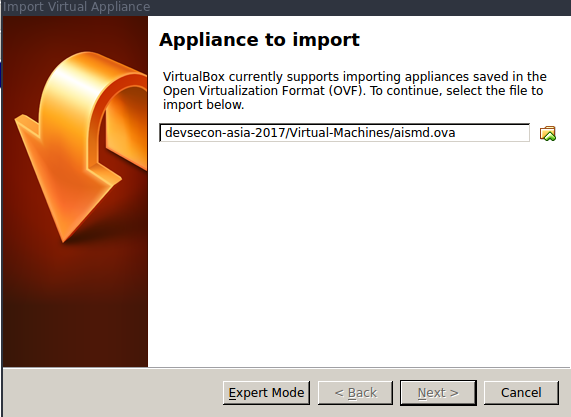


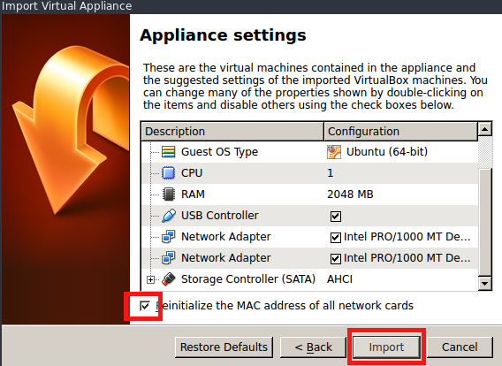


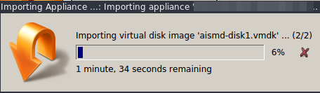


### Start the virtual machine and login

**username :: password**

monitor::monitor


### Please note
<!--  .slide: data-background="yellow" -->

- In this entire documentation. Please change the IP address as you have got
    + `192.168.56.101` is the `monitor` VM


### SSH into the monitor VM

switch to `root` user by entering the below command

```
ssh -l monitor 192.168.56.101
sudo -i
```


### Configure Elasticsearch Cluster

- Replace the below content using your choice of text editor.

 `vi /etc/elasticsearch/elasticsearch.yml`

```
cluster.name: ninja-infra-mon

node.name: node-1

bootstrap.memory_lock: true

network.host: 127.0.0.1

path.repo: "/var/backups/elasticsearch"

```

Note: make sure check the spaces before editing in the file


- Start Elasticsearch service by running

```
service elasticsearch restart
```


- Check whether Elasticsearch is running or not

```
curl -XGET 'http://localhost:9200'
```

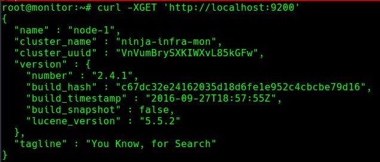

Note: It will take 3 to 5 seconds to start elasticsearch


### Setting up nginx reverse-proxy for elasticsearch and kibana

- Generate the basic authentication password by running `htpasswd`

```
htpasswd -c /etc/nginx/htpasswd.users elkadmin
```

```
Password : DevSecCon@123
Confirm Password : DevSecCon@123
```

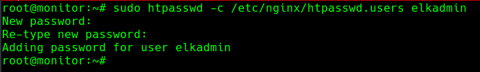


- Replace the nginx default configuration by editing

`vi /etc/nginx/sites-available/default`

```
server {
    listen 80; #for Kibana

    server_name localhost;

    auth_basic "Restricted Access";
    auth_basic_user_file /etc/nginx/htpasswd.users;

    location / {
        proxy_pass http://localhost:5601;
        proxy_http_version 1.1;
        proxy_set_header Upgrade $http_upgrade;
        proxy_set_header Connection 'upgrade';
        proxy_set_header Host $host;
        proxy_cache_bypass $http_upgrade;
    }
}

server {
    listen 8080; #for Elasticsearch

    server_name localhost;

    auth_basic "Restricted Access";
    auth_basic_user_file /etc/nginx/htpasswd.users;

    location / {
        proxy_pass http://localhost:9200;
        proxy_http_version 1.1;
        proxy_set_header Upgrade $http_upgrade;
        proxy_set_header Connection 'upgrade';
        proxy_set_header Host $host;
        proxy_cache_bypass $http_upgrade;
    }
}
```

- Restart the `nginx` service to apply the changes

```
service nginx restart
```


### Elasticsearch plug-ins overview

Plug-ins already installed in the system


Navigate to http://192.168.56.101:8080/_plugin/head

- Use the username `elkadmin` and password `DevSecCon@123`

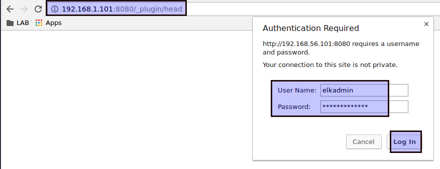

Note: Elasticsearch basic authentication login from nginx reverse-proxy


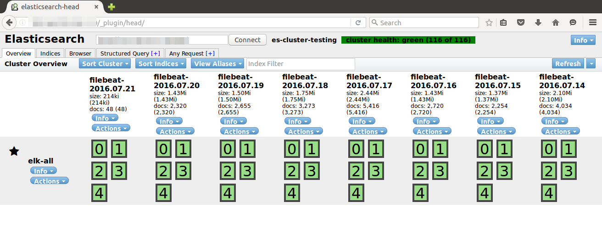

Note: Please use your monitor VM IP


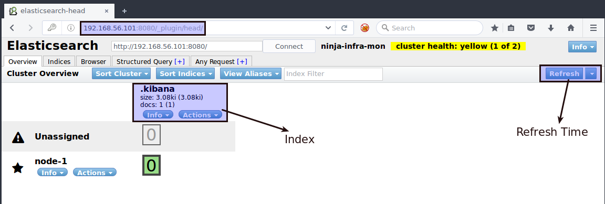

- <font color="green">`green`</font> - All primary and replica shards are active.
- <font color="yellow">`yellow`</font> - All primary shards are active, but not all replica shards are active.
- <font color="red">`red`</font> - Not all primary shards are active.


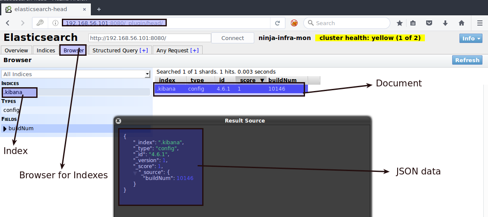


### Let's configure Logstash


### Basic Logstash configuration

```
input {
    stdin {}
    file {}
    ...
}

filter {
    grok {}
    date {}
    geoip {}
    ...
}

output {
   elasticsearch {}
   email {}
   ...
}
```


### Example grok

<div align="left">For the following log event:</div>

```
55.3.244.1 GET /index.html 15824 0.043
```

<div align="left">This would be the matching grok:</div>

```
%{IP:client} %{WORD:method} %{URIPATHPARAM:request} %{NUMBER:bytes} %{NUMBER:duration}
```

Note: 
1. The syntax for a grok pattern is `%{SYNTAX:SEMANTIC}`
2. `SYNTAX` is the name of the pattern that will match your text. For example: `1337` will be matched by the `NUMBER` pattern, `192.168.123.12` will be matched by the `IP` pattern.
3. `SEMANTIC` is the identifier you give to the piece of text being matched. E.g. `1337` could be the count and `192.168.123.12` could be a client making a request


### Consider the following Apache Log Event

```
123.249.19.22 - - [01/Feb/2015:14:12:13 +0000] "GET /manager/html HTTP/1.1" 404 448 "-" "Mozilla/3.0 (compatible; Indy Library)
```


Using a regular expression!!


Using Grok filter patterns :)

```
%{IPV4} %{USER:ident} %{USER:auth} \[%{HTTPDATE:timestamp}\] "(?:%{WORD:verb} %{NOTSPACE:request}(?: HTTP/%{NUMBER:httpversion})?)" %{NUMBER:response} (?:%{NUMBER:bytes}|-)
```


Things can get even more simpler using an *inbuilt* grok :) :)

```
%{COMBINEDAPACHELOG}
```


### Available Logstash Grok Patterns
- [https://grokdebug.herokuapp.com/patterns](https://grokdebug.herokuapp.com/patterns)
- [http://grokconstructor.appspot.com/](http://grokconstructor.appspot.com/)
- [https://github.com/logstash-plugins/logstash-patterns-core/blob/master/patterns/grok-patterns](https://github.com/logstash-plugins/logstash-patterns-core/blob/master/patterns/grok-patterns)
- [https://github.com/clay584/logstash_configs](https://github.com/clay584/logstash_configs)


### Create a logstash configuration to receive filebeat logs from infra VM

- Create the input file to receive logs from filebeat

`vi /etc/logstash/conf.d/02-beats.conf` in the `monitor` machine

```
input {
  beats {
    port => 5044
    ssl => true
    ssl_certificate => "/etc/pki/tls/certs/logstash-forwarder.crt"
    ssl_key => "/etc/pki/tls/private/logstash-forwarder.key"
  }
}
```


- Create the ssh logs filter file

`vi /etc/logstash/conf.d/10-ssh-log.conf`

```
filter {
 if [type] == "sshlog" {
  grok {

    match => [
      "message", "%{SYSLOGTIMESTAMP:syslog_date} %{SYSLOGHOST:syslog_host} %{DATA:syslog_program}(?:\[%{POSINT}\])?: %{WORD:login} password for %{USERNAME:username} from %{IP:ip} %{GREEDYDATA}",
      "message", "%{SYSLOGTIMESTAMP:syslog_date} %{SYSLOGHOST:syslog_host} %{DATA:syslog_program}(?:\[%{POSINT}\])?: message repeated 2 times: \[ %{WORD:login} password for %{USERNAME:username} from %{IP:ip} %{GREEDYDATA}",
      "message", "%{SYSLOGTIMESTAMP:syslog_date} %{SYSLOGHOST:syslog_host} %{DATA:syslog_program}(?:\[%{POSINT}\])?: %{WORD:login} password for invalid user %{USERNAME:username} from %{IP:ip} %{GREEDYDATA}",
      "message", "%{SYSLOGTIMESTAMP:syslog_date} %{SYSLOGHOST:syslog_host} %{DATA:syslog_program}(?:\[%{POSINT}\])?: %{WORD:login} %{WORD:auth_method} for %{USERNAME:username} from %{IP:ip} %{GREEDYDATA}"
    ]
  }

  date {
    match => [ "timestamp", "dd/MMM/YYYY:HH:mm:ss Z" ]
    locale => en
  }

  geoip {
    source => "ip"
  }
 }
}
```


- Create the web logs filter file

`vi /etc/logstash/conf.d/11-web-log.conf`

```
filter {
 if [type] == "weblog" {
  grok {
    match => {
      "message" => '%{IPORHOST:clientip} %{USER:ident} %{USER:auth} \[%{HTTPDATE:timestamp}\] "%{WORD:verb} %{DATA:request} HTTP/%{NUMBER:httpversion}" %{NUMBER:response:int} (?:-|%{NUMBER:bytes:int}) %{QS:referrer} %{QS:agent}'
    }
  }

  date {
    match => [ "timestamp", "dd/MMM/YYYY:HH:mm:ss Z" ]
    locale => en
  }

  geoip {
    source => "clientip"
  }

  useragent {
    source => "agent"
    target => "useragent"
  }
 }
}
```


- Create the output elasticsearch file

`vi /etc/logstash/conf.d/20-elastic-output.conf`

```
output {
  elasticsearch {
    hosts => ["localhost:9200"]
    manage_template => false
    index => "infra-%{+YYYY.MM.dd}"
  }
}
```


### Start the Logstash service

```
service logstash restart
```


### Start the kibana service

- Kibana is configured out of the box by default
```
service kibana restart
```


### Let's start the infra machine

- Infra machine can start by running the below command

```
docker run -d -p 8000:8000 --name infrasetup infra
```

Note: docker is container platform (it packages software into containers)


### Accessing Infrastructure Service

- Navigate to the below URL to access the web application (Replace the below IP with your virtual machine IP)

```
http://192.168.56.101:8000
```

- Browse to multiple links (Don't visit exploit links for now)


### Check the logs index in Elasticsearch Head plugin

- Navigate to the below URL to see that logs coming from infrastructure

```
http://192.168.56.101:8080/_plugin/head
```

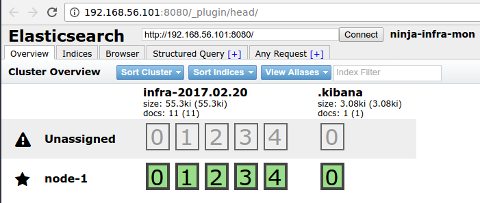


### Opening Index in Kibana

- Use the username `elkadmin` and password `DevSecCon@123`

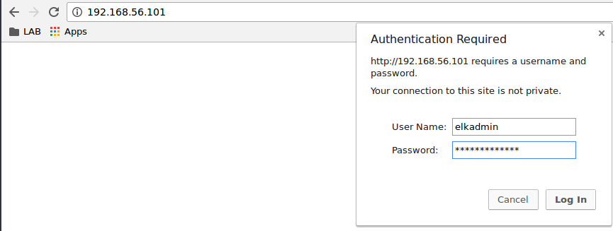


**Index Selection**

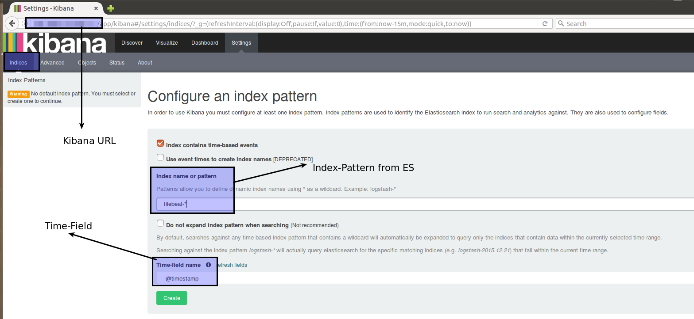

- Index for our workshop is `infra-*`

Note: Default kibana login screen


**Discovery**


Note: Kibana discovery for searching events


**Mapped log in JSON format**

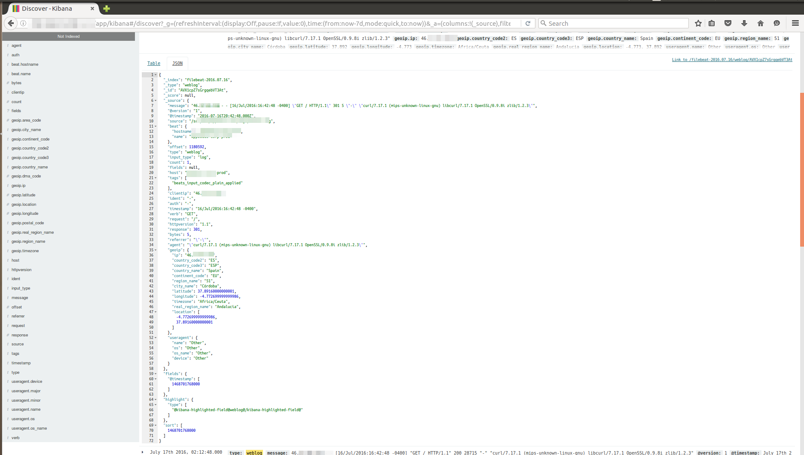


**Visualize**


- Choose a new visualization to create charts, graphs, etc.


**Selecting the search source**


- We can select the search source to create visualization. It can be saved search or new search


**Creating a pie chart**

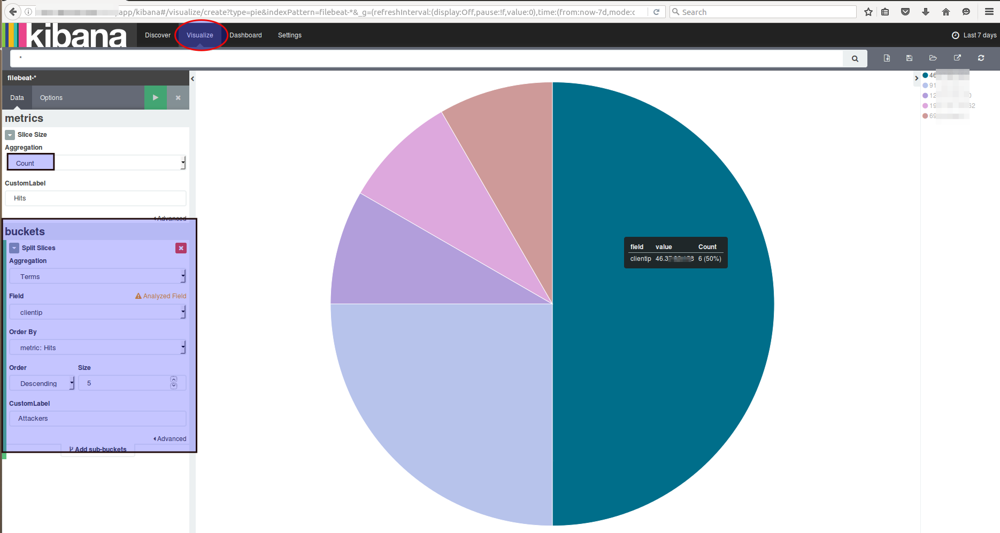

Note:
- Now we can select the aggregation, for example `count` and we can also give custom label to display
- Then create buckets splitting slices. select the field which you want to create a pie chart and select the size of the field to display.
- Once selection is done, Click on the play button to apply the changes


**Dashboard**

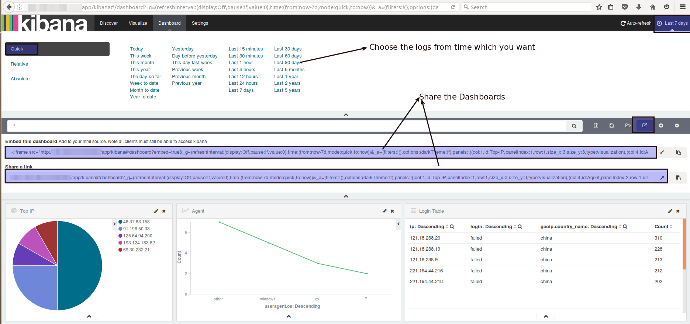

- Dashboards and visualizations can be imported and exported in JSON format


**Status**


**Import/Export**


### Generate the WEB attack traffic by running Nikto scan

- In the host machine run the below command

```
Windows: nikto.bat -host http://192.168.56.101:8000
Linux/Mac: perl nikto.pl -host http://192.168.56.101:8000
```

Note:
1. Nikto is an Open Source web server scanner which performs comprehensive tests against web servers for multiple items.


### Check Kibana search queries for 404 errors 

- Look for `404` errors in weblogs


### What is alerting for ELK stack?

> We can set up a notification system to let users/admins know that a pattern match has occurred.


### How is this achieved?

- Logstash output plugin alerting via (Email, Pager duty, JIRA, etc.)
- Elasticsearch commercial product - Watcher
- An open source alerting for elasticsearch by Yelp called `elastalert`


### Introducing elastalert

An opensource project by Yelp for alerting on Elasticsearch

> ElastAlert is a simple framework for alerting on anomalies, spikes, or other patterns of interest from data in Elasticsearch.


### Creating alerting for the attacks

- The elastalert is installed in `/opt/elastalert`
- Run the below commands to create elastalert index

```
elastalert-create-index
```


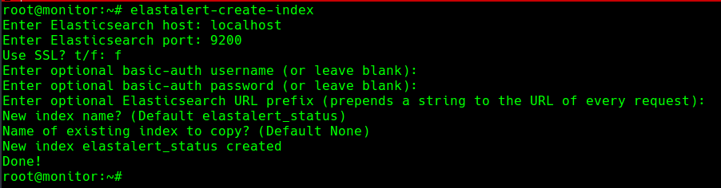

Note: Give the localhost and port and remaining defaults


### Creating rules for attacks


### Web 404 error logs attack rule

`vi /opt/elastalert/web-404-error-slack.yml`

```
es_host: localhost
es_port: 9200
name: "web 404 error log alert"
type: frequency
index: infra-*
num_events: 20
timeframe:
  hours: 24

# For more info: http://www.elasticsearch.org/guide/en/elasticsearch/reference/current/query-dsl.html

filter:
- query:
    query_string:
      query: "_type: weblog AND 404"

alert:
  - slack
  - email

slack:
slack_webhook_url: "https://hooks.slack.com/services/xxxxx"

email:
  - "root"

realert:
  minutes: 0
```

Note: Replace the Slack webhook


### Configuring the elastalert

- Replace the configuration file content

`vi /opt/elastalert/config.yaml`

```
rules_folder: example_rules
run_every:
  minutes: 1
buffer_time:
  minutes: 15
es_host: localhost
es_port: 9200
writeback_index: elastalert_status
alert_time_limit:
  days: 2
```


### Running alerting on indices

```
elastalert --verbose --config /opt/elastalert/config.yaml --start 2017-02-20 --rule /opt/elastalert/web-404-error-slack.yml
```

Note: config file and the start date and alerting rule. We can run this as a cron job in production (or) background process


### Check the slack channel

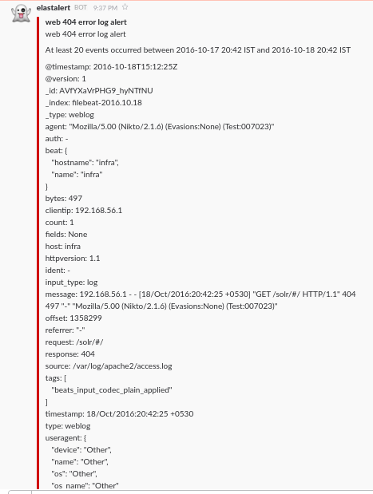


### Check Email as well (Base64 Encoded)

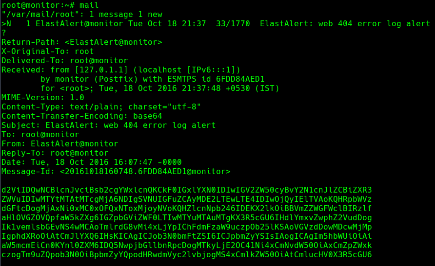


### Backing up Elasticsearch


### What is Curator ?

> Elasticsearch Curator helps you curate or manage your indices.
> Supports a variety of actions from delete a snapshot to shard allocation routing.


- Run the below command in monitor VM to setup the backups path

```
curl -XPUT 'http://localhost:9200/_snapshot/backup' -d '{
"type": "fs",
"settings": {
"location": "/var/backups/elasticsearch/",
"compress": true
}
}'
```


### To snapshot an index called `elastalert_status` into a repository `backup`

```
curator snapshot --name=elastalert_logs_snapshot --repository backup indices --prefix elastalert_status
```


### To see all snapshots in the `backup` repository

```
curator show snapshots --repository backup
```


### To restore a snapshot from curator

```
curl -XPOST 'http://localhost:9200/_snapshot/backup/elastalert_logs_snapshot/_restore'
```


### Restore sample logs to create some advanced dashboards

```
tar -xvf /srv/filebeat.tar.gz -C /var/backups/elasticsearch/

curator show snapshots --repository backup

curl -XPOST 'http://localhost:9200/_snapshot/backup/filebeat_logs_snapshot/_restore'
```

Note: We already have sample old logs, Restore them for creating advanced dashboards


### Look at head plug-in to see the restored sample logs

- Navigate to http://192.168.56.101:8080/_plugin/head

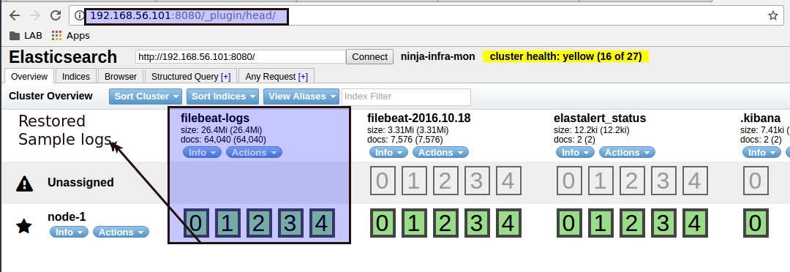


## Dashboards for Attack Patterns

Note: We have already imported logs to Elasticsearch using curator. <br />
Now create some advanced dashboards for attack patterns using Kibana


Note: we are creating new index for old filebeat logs


- Select the JSON file in your USB drive `/dashboards/all-kibana.json`

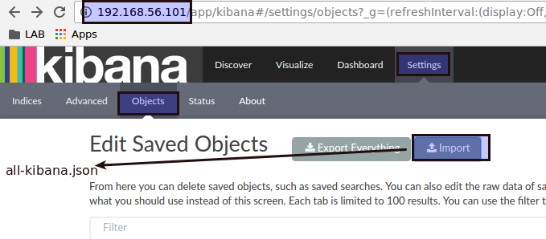


### Pre-created dashboards

- Access the pre-created dashboards using

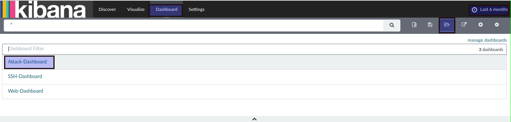


### Web Attack Dashboard


### SSH Attack Dashboard

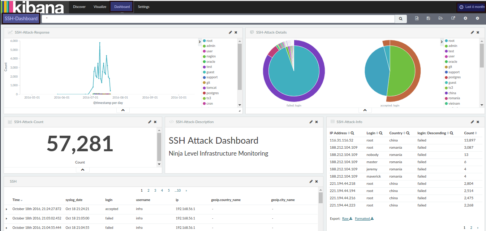


### Combined Attack Dashboard

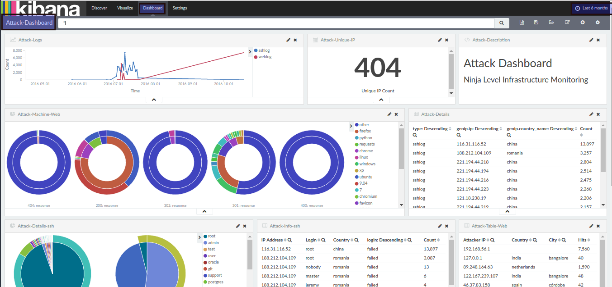


### Defence (ELK + AWS Lambda) - DEMO

<iframe frameborder=0 width=95% height=586 marginheight=0 marginwidth=0 scrolling=no src="https://youtube.com/embed/3_HIlDm3GtM?autoplay=0&controls=0&showinfo=0&autohide=1"></iframe>


### AWS Lambda - Chalice Code

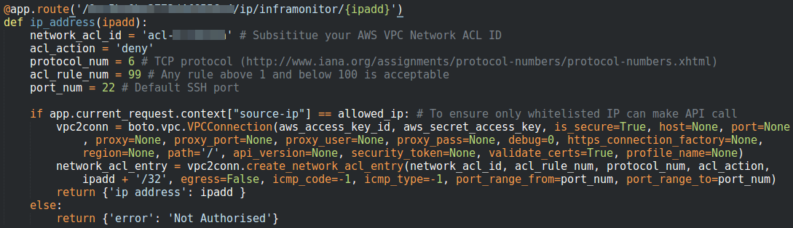

[https://github.com/appsecco/alldaydevops-aism](https://github.com/appsecco/alldaydevops-aism)

Note: boto is an SDK for AWS written in Python

### Security for our AWS Lambda service

We are primarily doing the following two things

1. A *sufficiently random token* to protect the request when we post the IP address from ElastAlert
2. *Whitelist* the IP address of the host where the `HTTP POST` request originates from


### Use Cases for Automated Defence

1. Automated Defender (Attack Alerts + Automated Firewall)
2. Security Analytics + Reports
3. Near real-time Centralised Log Monitoring


### Attack Scenario : Wordpress XML-RPC

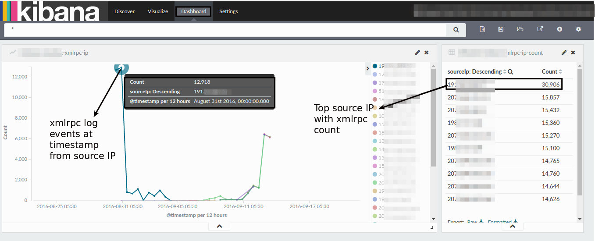

<small>[https://blog.appsecco.com/analysing-attacks-on-a-wordpress-xml-rpc-using-an-elk-stack-3bf25a7e36cc](https://blog.appsecco.com/analysing-attacks-on-a-wordpress-xml-rpc-using-an-elk-stack-3bf25a7e36cc/)</small>


### Needs Improvement

- More attack signatures required 
- For example [OSSEC Wazuh Ruleset](http://documentation.wazuh.com/en/latest/ossec_ruleset.html)
- Improve the ElastAlert Alerter custom code
- Any suggestions from your side?


### Pentesting Elastic Stack

[Elastic stack Pentesting Report](pentest-report.md)


### Alternatives and Best practices

[Alternatives & Best practices](alternatives-best-practices.md)


